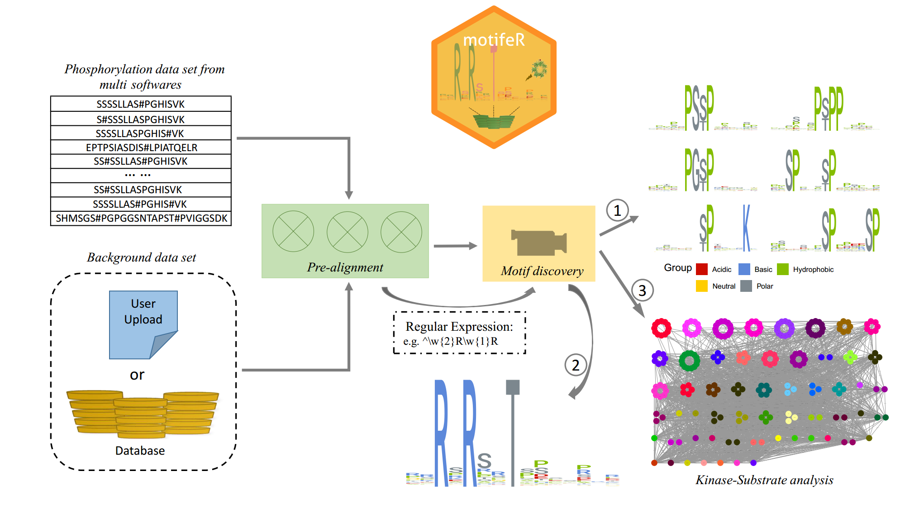

# motifeR
#### An integrated web software for identification and visualization of protein post-translational modification motifs

## Citation
If you use this software to analyze your data, please cite our paper like this:

Shisheng Wang, Yue Cai, Jingqiu Cheng, Wenxue Li, Yansheng Liu and Hao Yang. "motifeR: An Integrated Web Software for Identification and Visualization of Protein Post‐Translational Modification Motifs." Proteomics (2019): 201900245. ([DOI: 10.1002/pmic.201900245](https://doi.org/10.1002/pmic.201900245)).

## Brief Description
** motifeR ** is a free, user-friendly and comprehensive web software, can provide three main functions (sequence pre-alignment, motif discovery, kinase-substrate analysis) to help users find motifs of a protein or polypeptide and process kinase-substrate analysis for human data set subsequently. This software is available here: [https://www.omicsolution.org/wukong/motifeR](https://www.omicsolution.org/wukong/motifeR).

## How to use
A detailed introduction of this software can be found in [motifeR_Manual.pdf](https://github.com/wangshisheng/motifeR/blob/master/motifeR_Manual.pdf) file. And if you want to install this software locally, please download it from here: [https://github.com/wangshisheng/motifeRapp](https://github.com/wangshisheng/motifeRapp).

## Workflow

## Contact
You could push an issue on this github. And optionally, please feel free to sent me an e-mail if you have any question or find a bug about this tool. Thank you^_^
Email: wssdandan2009@outlook.com
